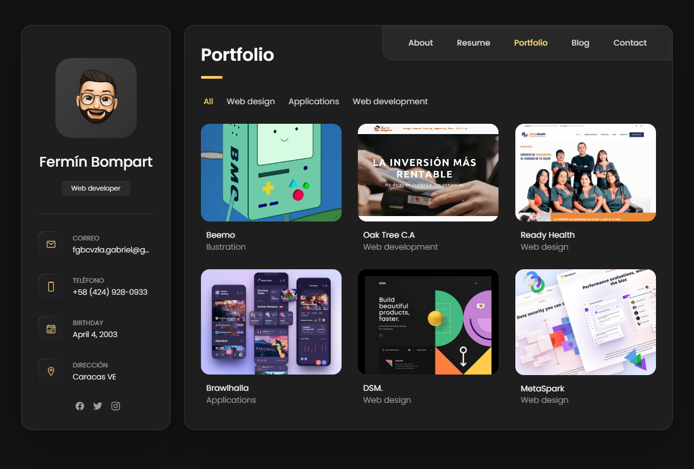

<h1>Personal Portfolio 💥</h1>

<h1>Built With</h1>
<ul>
  <li>HTML 5</li>
  <li>JS</li>
  <li>CSS</li>
</ul>

<h1>Features</h1>
<ul>
  <li>📖 Multi-Page Layout</li>
  <li>🎨 Styled with React-Bootstrap and Css with easy to customize colors</li>
  <li>📱 Fully Responsive</li>
</ul>

<h1>Getting Started</h1>

Clone down this repository. You will need node.js and git installed globally on your machine.

